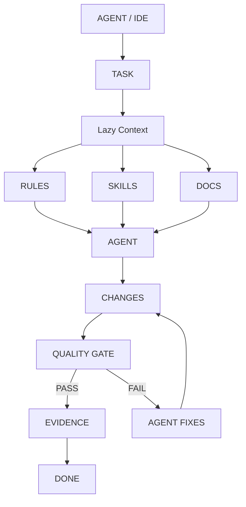

# Agent Engineering Framework V4.1

> A reusable project scaffold for building AI-assisted applications with declarative rules and deterministic validation, reusable agent workflows, lazy context, and automated quality validation.

## Overview

The Agent Engineering Framework V4.1 is a project base and scaffolding system designed specifically for AI-assisted development (such as with the Antigravity agent). Rather than just providing a code template, it provides a comprehensive orchestration framework that cleanly separates:

- **Orchestration**: Managing the lifecycle of tasks.
- **Rules**: Deterministic constraints on how code is written.
- **Skills**: Reusable agent workflows for standard operations.
- **Context**: Just-in-time, lazy loading of requirements and domain knowledge.
- **Implementation**: The actual Svelte 5 and Supabase application code.
- **Tooling**: Bash scripts for routine development tasks.
- **Validation**: A change-aware Quality Gate that produces objective evidence of success.

This structure reduces the impact of incorrect agent assumptions by moving critical verification into deterministic tooling.

## Core Architecture



- **Tasks** act as the state machine and central hub for an active piece of work.
- **Rules & Skills** constrain and guide the Agent's behavior.
- **Quality Gate** ensures that the Agent cannot arbitrarily decide a task is complete without passing deterministic, machine-readable validation checks.

## Responsibility / Authority Model

The framework relies on explicit ownership for every aspect of the project. The AI agent orchestrates and implements; deterministic tooling validates whenever possible.

| Responsibility            | Source of truth |
| ------------------------- | --------------- |
| Product requirements      | `docs/product/` (PRDs) |
| Business rules            | `docs/domains/` |
| Architectural constraints | `.agents/rules/` |
| Agent workflows           | `.agents/skills/` |
| Runtime implementation    | `src/` (Frontend) & `supabase/` (Backend) |
| Type safety               | TypeScript (`src/types/database.ts`) |
| Code restrictions         | ESLint (`eslint.config.js`) |
| Svelte validation         | Svelte Check |
| Unit tests                | Vitest |
| Database schema           | Supabase migrations (`supabase/migrations/`) |
| Database behavior / RLS   | pgTAP (`supabase/tests/`) |
| Final validation          | Quality Gate (`scripts/quality-gate.sh`) |

## Directory Structure

This project uses the following directory structure once scaffolded:

```text
.
├── .agents/
│   ├── rules/            # Deterministic project constraints (e.g., database.md, frontend.md)
│   └── skills/           # Agent workflows (e.g., new-feature, quality-gate)
├── docs/
│   ├── adr/              # Architecture Decision Records
│   ├── ai-context/       # Global context for the AI agent
│   ├── domains/          # Domain-specific business logic documentation
│   ├── features/         # Active and completed feature tasks
│   ├── product/          # Product Requirements Documents (PRDs)
│   └── protocols/        # Team and communication protocols
├── scripts/
│   ├── db-reset.sh       # Local database reset script
│   ├── generate-db-types.sh # Supabase type generation script
│   └── quality-gate.sh   # The core change-aware validation script
├── src/
│   ├── lib/              # Svelte components and shared logic
│   ├── routes/           # SvelteKit routes
│   └── types/            # Autogenerated TypeScript types (database.ts)
├── supabase/
│   ├── migrations/       # SQL migrations for schema changes
│   ├── tests/            # pgTAP database and RLS tests
│   ├── config.toml       # Supabase local configuration
│   └── seed.sql          # Local database seed data
├── eslint.config.js      # ESLint configuration
├── package.json          # Node dependencies and scripts
└── mcp-server.json       # Model Context Protocol server configuration
```

## Rules

Rules are declarative markdown files (located in `.agents/rules/`) that enforce constraints on the project. They define what the agent *must* and *must not* do.

- **What they are**: Small, atomic files defining project invariants.
- **What they control**: Technologies (e.g., Svelte 5 Runes only), architecture (e.g., RLS must be enabled), and standards.
- **Why they are small**: To minimize token consumption and provide laser-focused context to the AI.

**Rule vs Skill:** A Rule is a constraint (`database.md` enforces migrations), while a Skill is a workflow (`new-feature` initializes a task).

## Skills

Skills (located in `.agents/skills/`) define step-by-step workflows for the AI to execute. They ensure the AI follows the correct process instead of improvising.

The standard workflow shape is:
`INPUT → CONTEXT → STEPS → OUTPUT → VALIDATION`

**Available Skills:**
- `new-feature`: Initializes a new feature task, loading the required domain and product context, and creates `docs/features/<feature>/00-task.md` in a `READY` state.
- `quality-gate`: Orchestrates the validation loop, running `./scripts/quality-gate.sh`, evaluating the result, and transitioning the task to `DONE` with YAML evidence upon passing.

## Lazy Context

To remain token-efficient and prevent AI hallucination, the framework employs a **Lazy Context** strategy:
> *Load the minimum context required to make the next valid decision.*

Instead of dumping the entire repository or a massive PRD into the AI's context window, Tasks act as references.

For example, a task file (`docs/features/orders-filter/00-task.md`) explicitly lists the specific PRD (`docs/product/orders-prd.md`) and Domain (`docs/domains/orders.md`) it needs. The agent only reads these exact files when working on this specific task.

## Task Workflow

Feature development is driven by a strict state machine implemented in the task files.

```text
READY
  ↓
IN_PROGRESS
  ↓
IMPLEMENTED
  ↓
VALIDATING
  ├── FAIL → IN_PROGRESS
  │
  └── PASS → DONE
```

A task is never complete just because the AI claims it is. It can only transition to `DONE` when objective, machine-readable evidence is generated by the Quality Gate.
The state machine is deterministically enforced. The Quality Gate explicitly verifies the required task frontmatter and rejects any invalid states. Furthermore, evidence becomes invalid automatically when the codebase changes (via a checksum match), preventing stale evidence reuse.

## Feature Development — Step by Step

### Step 1 — Create the task
The agent runs the `new-feature` skill, asking the user for the domain, feature name, and PRD. It initializes `docs/features/<feature>/00-task.md`.

### Step 2 — Identify the relevant context
The `new-feature` skill verifies the existence of the requested `docs/product/<PRD>.md` and `docs/domains/<domain>.md`.

### Step 3 — Load only the required context
The agent reads only the files linked in the "Lazy Context" section of the task file.

### Step 4 — Identify applicable Rules
The agent checks `.agents/rules/` (e.g., `frontend.md`, `database.md`, `project.md`, `testing.md`) to understand the constraints for its upcoming changes.

### Step 5 — Select the appropriate Skill
For standard implementation, the agent works autonomously. For validation, it will use the `quality-gate` skill.

### Step 6 — Implement the change
The agent modifies `src/` (Svelte 5 Runes) or `supabase/migrations/` as required, strictly adhering to the rules.

### Step 7 — Run validation
The agent updates the task status to `VALIDATING` and invokes the `quality-gate` skill.

### Step 8 — Fix failures
If `./scripts/quality-gate.sh` fails, the agent inspects the explicit error output, fixes the application code, and runs validation again.
`IMPLEMENT → VALIDATE → INSPECT FAILURE → FIX → VALIDATE AGAIN`

### Step 9 — Record evidence
Once the quality gate passes, the `quality-gate` skill copies the YAML output (the evidence).

### Step 10 — Mark the task as complete
The agent updates the task status to `DONE` and pastes the evidence into the task file.

## Quality Gate

The Quality Gate (`./scripts/quality-gate.sh`) is a deterministic bash script that validates the integrity of the project.
> *Validation should be deterministic whenever possible.*

It produces machine-readable YAML output, making it easy for the AI to parse success or failure and the exact check that failed.

It runs framework integrity checks first:
- **Task Metadata**: Ensures `domain`, `prd`, `status`, and `traceability` are present.
- **Task State**: Ensures state machine compliance and that `DONE` tasks have valid, fresh evidence (verifying checksums to invalidate stale evidence).
- **ShellCheck**: Validates all framework bash scripts to protect the tooling layer.
- **Lockfile Synchronization**: Validates that `package.json` is not newer than `package-lock.json` to prevent dependency drift.

Then it runs application-level checks:
- `svelte-check` for Svelte template and type validation.
- `eslint` for linting.
- `vitest` for frontend/logic testing.
- `supabase test db` for database pgTAP testing.
- Type freshness checks (ensuring `src/types/database.ts` matches the local database schema).

## Change-Aware Validation

The Quality Gate is change-aware. It inspects `git diff` to determine what files have changed and skips irrelevant checks to save time.

- **Documentation change only** (`docs/*`, `*.md`, `.agents/*`): Skips Svelte, ESLint, Vitest, and DB checks.
- **Frontend source change** (`src/routes/*`, `*.svelte`, etc.): Runs Svelte Check, ESLint, and Vitest. Skips DB tests.
- **Database change** (`supabase/*`): Runs Supabase DB tests.
- **Global configuration change** (`package.json`, `*.js`): Runs all checks.

## Database Workflow

The database relies entirely on Supabase.
> *Database schema changes must be represented by migrations.*

- **Schema Mutability**: Direct hot-swapping or UI alterations are forbidden. All schema changes happen via `supabase/migrations/`.
- **Security**: Row Level Security (RLS) is strictly enforced for every table.
- **Tests**: Database logic and RLS policies are tested using pgTAP in `supabase/tests/`.
- **Validation Commands**:
  - Test database: `supabase test db`
  - Generate Types: `supabase gen types typescript --local`

## Generated Files

Files that are autogenerated must never be edited manually by developers or AI.

- `src/types/database.ts`: This file is generated by Supabase based on the local database schema. To update it, run `./scripts/generate-db-types.sh` or `supabase gen types typescript --local`.

## Installation / Prerequisites

Before working on the project, ensure you have the required tooling installed:

| Requirement  | Detail |
| ------------ | ------- |
| Node.js      | Latest LTS recommended |
| npm          | For dependency management (`npm install`, `npm run lint`) |
| Docker       | Required for local Supabase development |
| Supabase CLI | Required for database testing and migrations |
| Git          | Required for change-aware validation logic |

## Quick Start

1. **Clone the scaffold / Create your repository**:
   ```bash
   git init my-project
   cd my-project
   ```
2. **Apply the scaffold framework**:
   Copy the `scaffold_template.sh` and `template/` folder into your new repo, then run:
   ```bash
   ./scaffold_template.sh
   ```
3. **Install dependencies**:
   ```bash
   npm install
   ```
4. **Start Supabase locally** (requires Docker):
   ```bash
   supabase start
   ```
5. **Start development**:
   ```bash
   npm run dev
   ```

## Using the Scaffold

To generate the project infrastructure in a new Git repository:

1. Copy `scaffold_template.sh` and the `template/` directory to the root of your newly initialized Git repository.
2. Run `./scaffold_template.sh`.

**Behavior:**
- The script verifies it is being run from the root of a Git repository.
- It copies all files and directories from `template/` directly into the repository root.
- The scaffold focuses entirely on creating project infrastructure and tooling; it does not dictate your actual application product code.

**Optional Git Hooks:**
You can install an additional local enforcement layer that runs the Quality Gate before every commit by executing:
```bash
./scripts/install-hooks.sh
```
*Note: Local git hooks can always be bypassed with `git commit --no-verify`, so they act as a local convenience layer, not an absolute guarantee.*

## AI / IDE Workflow

The interaction loop for an AI agent (like Antigravity or any compatible IDE) is strictly defined:

```text
Agent / IDE
    ↓
reads task
    ↓
loads required context (Lazy Context)
    ↓
applies Rules (from .agents/rules/)
    ↓
uses appropriate Skill (from .agents/skills/)
    ↓
implements code changes
    ↓
runs deterministic validation (quality-gate.sh)
    ↓
fixes failures based on objective output
    ↓
produces evidence and closes task
```

AI reasoning is used for *implementation* and *problem-solving*, while **deterministic verification** (bash scripts, linters, tests) is used for validating success. Subjective LLM claims of success are completely ignored in this framework.

## Token / Context Efficiency

The architecture is explicitly designed to reduce unnecessary context consumption, saving costs and preventing LLM confusion:

- **Lazy context**: Only pulling in docs explicitly referenced by the active task.
- **Single source of truth**: Documentation isn't duplicated; it is referenced.
- **Small atomic Rules**: Focused markdown files for constraints.
- **Change-aware checks**: Validation only runs what is necessary.
- **Deterministic tooling over LLM judgement**: We use `eslint` and `svelte-check`, instead of asking the AI to "review the code for errors".

## Contributing

To extend the framework:

- **Adding a Rule**: Create a new `.md` file in `.agents/rules/` when you have a strict architectural constraint or code style that the AI must never violate. Keep it declarative and brief.
- **Adding a Skill**: Create a new folder with a `SKILL.md` in `.agents/skills/` when you want to define a multi-step workflow for the AI to follow consistently.
- **Adding a Script**: If a validation or automation can be done deterministically via bash, put it in `scripts/`. Always prefer deterministic scripts over complex AI prompts.
- **Adding Documentation**: Place PRDs in `docs/product/`, business logic in `docs/domains/`, and feature checklists in `docs/features/`.

## Design Principles

1. **Single Source of Truth**: Data and requirements live in one place and are referenced, never duplicated.
2. **Deterministic Validation**: Success is defined by passing tests, not LLM judgement.
3. **Minimal Context**: Provide the AI only what it needs right now.
4. **Explicit Ownership**: Every file and folder has a strict purpose.
5. **Declarative Rules**: Constraints are simple, clear, and absolute.
6. **Reusable Workflows**: Common agent operations are codified into Skills.
7. **Evidence Over Claims**: Tasks are DONE only when machine-readable output proves it.
8. **Tooling Over Prompting**: If a script can do it reliably, don't ask the LLM to do it.

## Troubleshooting

- **Quality gate fails**: Inspect the YAML output to see exactly which check failed. If `eslint` fails, you can run `npm run lint` directly to debug. If `vitest` fails, run `npm run test`.
- **Database tests fail**: Verify that local Supabase is running (`supabase status`). Use `./scripts/db-reset.sh` if your local state is corrupted.
- **Generated types are stale**: The quality gate will fail if `src/types/database.ts` doesn't match the migrations. Run `./scripts/generate-db-types.sh` or `supabase gen types typescript --local` to regenerate them.

---

## TL;DR — Stupid-Proof Step-by-Step Guide

Want to build a feature but don't want to read the whole doc? Follow these exact steps:

**1. Scaffold a New Project**
Create a new folder, initialize git, and copy the framework in:
```bash
git init my-app && cd my-app
cp -a /path/to/ProjectBase/scaffold_template.sh .
cp -a /path/to/ProjectBase/template .
./scaffold_template.sh
```

**2. Setup your Environment**
Install dependencies and start the backend:
```bash
npm install
supabase start
```

*(Optional)* Run `./scripts/install-hooks.sh` to block yourself from committing broken code.

**3. Define What You Want (Once per domain/feature)**
Before asking the AI to code, you MUST create two markdown files to explain what you're building:
- Create `docs/product/my-feature-prd.md` (What is the feature and why?)
- Create `docs/domains/my-domain.md` (What are the business rules and database models?)

**4. Start a Task with the AI**
Open your AI Agent (like Antigravity or Cursor) and literally type this:
> "Run the `new-feature` skill for domain `my-domain`, feature `my-feature`, and PRD `my-feature-prd`."

**5. Let the AI Code**
The AI will create a task file in `docs/features/my-feature/00-task.md`. Let it implement the code. 
If it gets stuck, remind it: *"Check the rules in `.agents/rules/`"*.

**6. Validate and Finish**
When the AI thinks it is done, tell it:
> "Run the `quality-gate` skill."

If it fails, the AI must read the error and fix the code. If it passes, the task is DONE. Commit your code!
