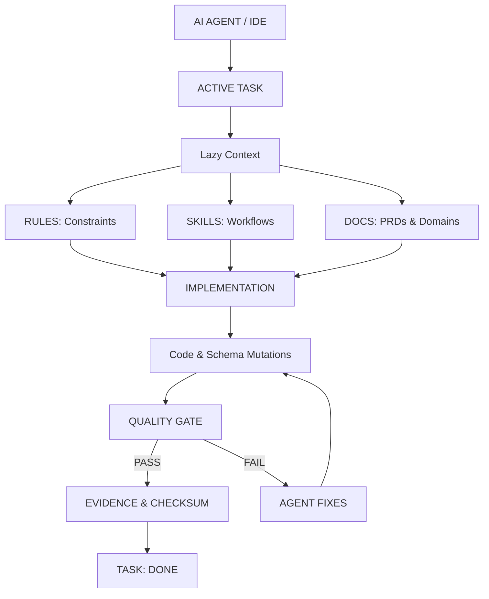

# Agent Engineering Framework V4.1

> A reusable project scaffold and orchestration system for building AI-assisted applications with declarative constraints, deterministic validation, lazy context, and an automated Quality Gate.

---

## Overview

The **Agent Engineering Framework V4.1** is an engineering foundation designed specifically for autonomous AI agents (such as Google Antigravity) and human developers working in pair programming. Rather than acting as a simple code starter, it defines a rigid separation of concerns:

- **Orchestration**: Structured task state machines with explicit evidence requirements.
- **Rules**: Deterministic architectural and style constraints that agents must never violate.
- **Skills**: Step-by-step agent workflows for routine engineering operations.
- **Lazy Context**: Targeted, on-demand loading of requirements and domain specifications to minimize token usage and eliminate hallucinations.
- **Implementation**: Modern web applications built on **Svelte 5 Runes**, TypeScript, Tailwind CSS, and Supabase.
- **Tooling**: Portable Bash scripts for routine tasks and framework integrity.
- **Validation**: An automated, change-aware **Quality Gate** that enforces deterministic verification over subjective LLM claims.

---

## Core Architecture



### Architectural Principles

1. **Deterministic Verification over LLM Claims**: A task is never marked complete because an LLM claims it is done. It can only reach `DONE` status when verified by machine-readable output from `scripts/quality-gate.sh`.
2. **Lazy Context & Minimal Token Consumption**: Context is loaded strictly just-in-time from explicit references in `00-task.md`.
3. **Strict State Machine**: Tasks follow `READY -> IN_PROGRESS -> IMPLEMENTED -> VALIDATING -> DONE`.
4. **Codebase Checksum Integrity**: The Quality Gate computes an md5/sha checksum over `src/`, `supabase/`, and `package.json`. If code changes after validation, previous evidence is invalidated.

---

## Responsibility & Authority Model

| Layer | Responsibility | Source of Truth |
| :--- | :--- | :--- |
| **Product Requirements** | Feature goals, acceptance criteria | `docs/product/` (PRDs) |
| **Domain Logic** | Business calculations, domain models | `docs/domains/` & `src/lib/domain/` |
| **Architectural Rules** | Technology invariants, coding constraints | `.agents/rules/` |
| **Agent Workflows** | Procedural instructions for agents | `.agents/skills/` |
| **Frontend Implementation** | UI components, pages, client logic | `src/lib/` (Svelte 5 Runes) |
| **Database Schema & RLS** | Migrations, table schemas, security policies | `supabase/migrations/` |
| **Type Safety** | Autogenerated database types | `src/types/database.ts` |
| **Linter & Code Style** | Syntax and formatting rules | `eslint.config.js` |
| **Template Validation** | Svelte template diagnostics and types | `svelte-check` |
| **Unit & Integration Tests**| Domain logic and component behavior | Vitest (`*.test.ts`) |
| **Deterministic Validation**| Automated validation and checksums | `scripts/quality-gate.sh` |

---

## Directory Structure

```text
.
├── .agents/
│   ├── rules/                       # Declarative constraints
│   │   ├── database.md              # Migrations and mandatory RLS rules
│   │   ├── frontend-design.md       # Cognitive UI ergonomics and zen interaction
│   │   ├── frontend.md              # Svelte 5 Runes only, Valibot validation
│   │   ├── project.md               # Svelte 5, Supabase types, Quality Gate rules
│   │   └── testing.md               # Vitest for frontend, pgTAP for database
│   └── skills/                      # Codified agent workflows
│       ├── new-feature/             # Workflow to initialize features
│       └── quality-gate/            # Workflow to validate tasks
├── docs/
│   ├── ai-context/
│   │   └── TASK.md                  # Active working context for the current task
│   ├── domains/
│   │   └── active-recall.md         # Active recall domain documentation
│   ├── features/                    # Feature specifications & state tracking
│   │   ├── active-recall-session/   # FSRS study session feature
│   │   │   └── 00-task.md           # Task state, checklist, and evidence
│   │   └── cognitive-ui-system/     # Cognitive UI feature
│   │       └── 00-task.md           # Task state and deliverables
│   └── product/
│       └── ui-system-prd.md         # PRD for the cognitive study UI
├── scripts/
│   ├── db-reset.sh                  # Reset local database
│   ├── generate-db-types.sh         # Generate TypeScript types from Supabase
│   ├── install-hooks.sh             # Install pre-commit quality gate hook
│   └── quality-gate.sh              # Core change-aware deterministic validator
├── src/
│   ├── lib/
│   │   ├── components/
│   │   │   ├── study/               # Full feature components
│   │   │   │   ├── StudySession.svelte  # Svelte 5 study session orchestrator
│   │   │   │   └── StudySession.test.ts # Vitest component integration tests
│   │   │   └── ui/                  # Reusable low-fatigue UI primitives
│   │   │       ├── RatingButton.svelte  # FSRS rating button with shortcut badge
│   │   │       ├── RecallInput.svelte   # Distraction-free recall textarea
│   │   │       ├── StudyCard.svelte     # Centered zen study card container
│   │   │       ├── ZenHeader.svelte     # Subtle "X of Y" progress header
│   │   │       └── ui-components.test.ts# Vitest UI component tests
│   │   └── domain/                  # Pure domain logic (zero UI/DB coupling)
│   │       ├── fsrs.ts              # FSRS / SM-2 spaced repetition calculator
│   │       ├── fsrs.test.ts         # Vitest unit tests for domain logic
│   │       └── review-schema.ts     # Runtime schema validation
│   ├── types/
│   │   └── database.ts              # Autogenerated Supabase TypeScript contracts
│   └── test-setup.ts                # Vitest & Jest-DOM setup
├── supabase/
│   ├── migrations/                  # Idempotent database migrations
│   │   └── 20260904180000_create_study_reviews.sql # Study reviews table & RLS
│   ├── config.toml                  # Supabase local ports & configuration
│   └── seed.sql                     # Seed data for development
├── eslint.config.js                 # ESLint flat config with Svelte 5 parser
├── package.json                     # Scripts, devDependencies, and test runners
├── tsconfig.json                    # Strict TypeScript configuration
└── vitest.config.ts                 # Vitest test runner configuration
```

---

## Reference Implementations Included

This repository comes with production-ready reference implementations illustrating every layer of the framework:

### 1. Pure Domain Logic & Validation (`src/lib/domain/`)
- **`fsrs.ts`**: A pure mathematical implementation of the Free Spaced Repetition Scheduler (FSRS / SM-2) algorithm. Calculates next interval days, ease factors, and review dates deterministically.
- **`review-schema.ts`**: Runtime input boundary validation ensuring external user submissions comply with domain constraints without `any` or `@ts-ignore`.

### 2. Cognitive Ergonomics UI (`src/lib/components/`)
Built under `.agents/rules/frontend-design.md`:
- **Zen Interaction**: No stressful countdown timers, no sidebar clutter, only subtle "X of Y" progress.
- **Visible Badges**: Keyboard shortcuts are displayed clearly on interactive elements (`[1]`, `[2]`, `[3]`, `[4]`, `[Espacio]`, `[Cmd/Ctrl+Enter]`).
- **Cognitive Palette**: Low eye-strain tones (`bg-slate-950`, `bg-slate-900/90`, `border-slate-800/60`).
- **Svelte 5 Runes**: Built strictly with `$state`, `$derived`, and `$props`.

### 3. Database Layer & Row Level Security (`supabase/migrations/`)
- **`study_reviews`**: Idempotent table storing card IDs, FSRS ratings (1-4), recalled text, ease factors, and intervals.
- **Strict RLS Policies**: Idempotent policies ensuring authenticated users can only query and insert their own review records (`auth.uid() = user_id`).

---

## Deterministic Quality Gate

The Quality Gate (`scripts/quality-gate.sh`) ensures that code cannot be merged without objective validation:

```bash
bash scripts/quality-gate.sh
```

### Validation Phases

1. **Framework Integrity Checks**:
   - `task_metadata`: Ensures all feature task files (`docs/features/*/00-task.md`) have required fields (`domain`, `prd`, `status`, `traceability`).
   - `task_state`: Verifies tasks marked `DONE` have passing validation evidence matching the current codebase checksum.
   - `shellcheck`: Validates all bash scripts with ShellCheck.
   - `lockfile`: Ensures `package-lock.json` is in sync with `package.json`.

2. **Change-Aware Application Checks**:
   - If only docs change (`docs/*`, `*.md`), application tests are skipped for efficiency.
   - If frontend code changes (`src/`, `*.svelte`, `*.ts`):
     - `svelte-check`: Zero diagnostic errors or warnings.
     - `eslint`: Zero linting errors.
     - `vitest`: 100% test suite execution (22 passing unit & integration tests).
   - If database schema changes (`supabase/*`):
     - `pgTAP`: Database unit tests via Supabase CLI.
     - Type Freshness: Confirms `src/types/database.ts` matches migrations.

---

## Installation & Prerequisites

| Requirement | Recommended Version | Purpose |
| :--- | :--- | :--- |
| **Node.js** | `>= 20.0.0` (v22.14.0 LTS verified) | Runtime for Svelte 5, Vite, Vitest, and ESLint |
| **npm** | `>= 10.0.0` | Package manager |
| **ShellCheck** | `>= 0.11.0` | Static analysis for framework bash scripts |
| **Git** | `>= 2.40.0` | Version control and change-aware diff detection |
| **Supabase CLI** | Optional / Development | Local database testing (`supabase start`, `supabase test db`) |
| **Docker** | Optional / Development | Container runtime required by Supabase CLI |

---

## Quick Start Guide

### 1. Working Inside This Repository
```bash
# Install dependencies
npm ci

# Run test suites
npm test

# Run linter and Svelte template check
npm run lint
npm run typecheck

# Run the complete Quality Gate
bash scripts/quality-gate.sh
```

---

## AI Agent Workflow (Antigravity & IDE)

When working with an AI agent in this framework, follow this structured process:

```text
1. SPECIFY
   - Create or update docs/ai-context/TASK.md with Given/When/Then criteria.
   - Initialize docs/features/<feature>/00-task.md with status: READY.

2. DATABASE MODELING (if applicable)
   - Draft idempotent SQL migration in supabase/migrations/.
   - Enforce ROW LEVEL SECURITY (RLS) on every table.
   - Synchronize src/types/database.ts.

3. TDD RED PHASE
   - Write pure domain logic unit tests in src/lib/.../*.test.ts.
   - Write component integration tests.
   - Run Vitest and confirm tests fail (RED state).

4. TDD GREEN PHASE
   - Implement the minimum code in TypeScript & Svelte 5 Runes.
   - Use cognitive ergonomics rules and Tailwind CSS.
   - Run Vitest and confirm all tests pass (GREEN state).

5. QUALITY GATE VALIDATION
   - Run: bash scripts/quality-gate.sh
   - Must exit with code 0.

6. ACCEPTANCE REVIEW & DONE
   - Verify every acceptance criterion against actual behavior.
   - Transition status to DONE in 00-task.md and record YAML evidence.
   - Propose Conventional Commit message.
```

---

## License

MIT License. Designed for AI agent engineering and modern Svelte 5 application development.
